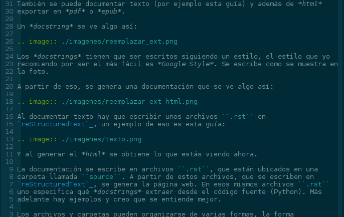

.. toctree::
   :maxdepth: 3
   :caption: Contenidos:

   instalacion
   escribir
   publicar
   ejemplos
   recetas/inicio
   src/miproyecto

Esta es una guía simple sobre cómo documentar código escrito en python con
`Sphinx`_. Comenzar con la página sobre la instalación y luego con la que
explica cómo escribir la documentación, al final se puede ver la pagina sobre
cómo publicar en GitHub y los ejemplos.

Si no hay ganas de aprender tanto hay recetas que dicen cómo configurar y hacer
todo bien rápido sin tantas explicaciones.

También hay una presentación que puede servir como introducción.

.. todo::

  Link

Introducción
------------

Esto sirve para generar documentación en una página web como esta a partir de
*docstrings* que son comentarios especiales que uno pone en el código fuente. Lo
que hay que hacer es configurar *Sphinx* y luego cada tanto correr un comando y
generar los archivos *html* con la documentación.

También se puede documentar texto (por ejemplo esta guía) y además de *html*
exportar en *pdf* o *epub*.

Un *docstring* se ve algo así:

.. image:: ./imagenes/reemplazar_ext.png

Los *docstrings* tienen que ser escritos siguiendo un estilo, el estilo que yo
recomiendo por ser el más fácil es *Google Style*. Se escribe como se muestra en
la foto.

A partir de eso, se genera una documentación que se ve algo así:

.. image:: ./imagenes/reemplazar_ext_html.png

También se puede documentar texto que se escribe algo así:

.. todo::

  Actualizar screenshot

Y se ve como lo que estás viendo ahora.

La documentación se escribe en archivos ``.rst``, que están ubicados en una
carpeta llamada ``source``. A partir de estos archvos, que se escriben en
*reStructuredText*, se genera la página web.

Los archivos y carpetas pueden organizarse de varias formas, la forma
`recomendada`__ de organizar el proyecto es::

  .
  ├── docs
  │   ├── build
  │   │   ├── ...
  │   │   └── html
  │   │       ├── ...
  │   │       └── index.html
  │   ├── Makefile
  │   └── source
  │       ├── ...
  │       ├── conf.py
  │       └── index.rst
  ├── LICENSE.txt
  ├── README.md
  └── miproyecto
      ├── ...
      └── main.py

__ http://docs.python-guide.org/en/latest/writing/structure/

En ``docs`` va toda la documentación, dentro hay un ``Makefile`` y las carpetas
``source`` y ``build``.

``source`` tiene la documentación escrita en `reStructuredText`_ y un archivo
``conf.py`` con las configuraciones usadas por `Sphinx`_.  Dentro de ``build``
está la misma documentación en *html* ya generada por `Sphinx`_. Por último el
``Makefile`` permite generar la documentación con un solo comando.

Después en otra carpeta aparte, ``miproyecto`` está el código. ``LICENSE.txt`` y
``README.md`` se suelen agregar para presentar el proyecto en por ejemplo
`GitHub`_.

Notas
-----

* Cuando probé *Sphinx* en *Ubuntu* tuve un problema, al hacer ``make html``
  recibía un error que decía ``No module named sphinx``. Lo solucioné
  modificando el ``Makefile``, cambiando ``python -msphinx`` por
  ``sphinx-build``.

Glosario
--------

Las cosas que se usan para hacer esto son:

* **Python**: Es el lenguaje de programación que usamos para hacer el programa.
  Hay comentarios especiales que documentan una función, clase, etc. que se
  llaman **docstrings**.

* **Sphinx**: Es un programa que nos ayuda a generar la documentación para ese
  programa. Toma varios archivos escritos con **reStructuredText** y junto con
  los **docstrings** genera una página web estática.

* **reStructuredText**: Es un lenguaje de marcado, especifica como crear
  títulos, listas, tablas, cómo insertar imagenes, etc.

* **GitHub**: Es un sitio web que hostea sobre todo proyectos de software libre
  de forma gratuita. Permite hostear una web estática para cada proyecto, que
  viene perfecto para la documentación generada con **Sphinx** pero es opcional.

Esto es sobre *Python*:

* **módulo** o **script**: Es un archivo ``.py``.

* **paquete**: Es una carpeta que contiene archivos ``.py``. Debe tener un
  archivo (que puede estar vacío) llamado ``__init__.py``.

.. todo::

  * Hacer ejemplos de los tres metodos. Y linkearlos por todos lados.

  * Actualizar la documentacion general.

  * Ver como incluir al ``toctree`` a las recetas.

  * Buscar en todos lados referencias a los temas y linkear al documento.

  * Ver que pasa cuando se pone un punto en el título de página

.. _Sphinx: http://www.sphinx-doc.org/en/stable/
.. _Repositorio: https://github.com/martinber/guia-sphinx
.. _reStructuredText: http://docutils.sourceforge.net/rst.html
.. _GitHub: https://github.com/
